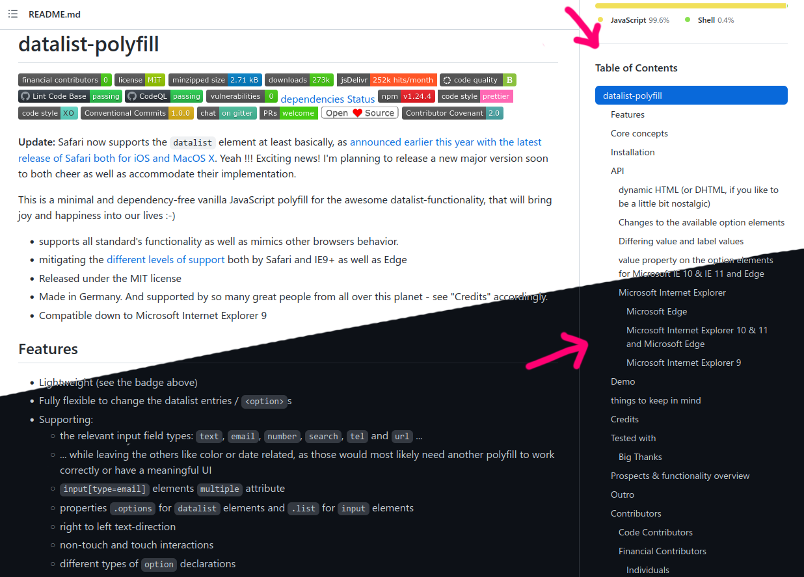

### GitHub Sidebar ToC

_"... finally using that wasted sidebar space" – radiantly_

 

## Installation

1. You will need a userscript manager like [Violentmonkey](https://violentmonkey.github.io/). Install it for Firefox [here](https://addons.mozilla.org/firefox/addon/violentmonkey/) or Chrome [here](https://chrome.google.com/webstore/detail/violent-monkey/jinjaccalgkegednnccohejagnlnfdag).
2. Click [here](https://cdn.jsdelivr.net/gh/radiantly/GitHub-Sidebar-ToC@main/script.user.js) to install the userscript.

## Usage

There's no configuration to do. Once installed, the table of contents should start appearing in the sidebar.

## License

MIT. 

Logo illustration by [Icons 8](https://icons8.com/illustrations/author/zD2oqC8lLBBA) from [Ouch!](https://icons8.com/illustrations)
